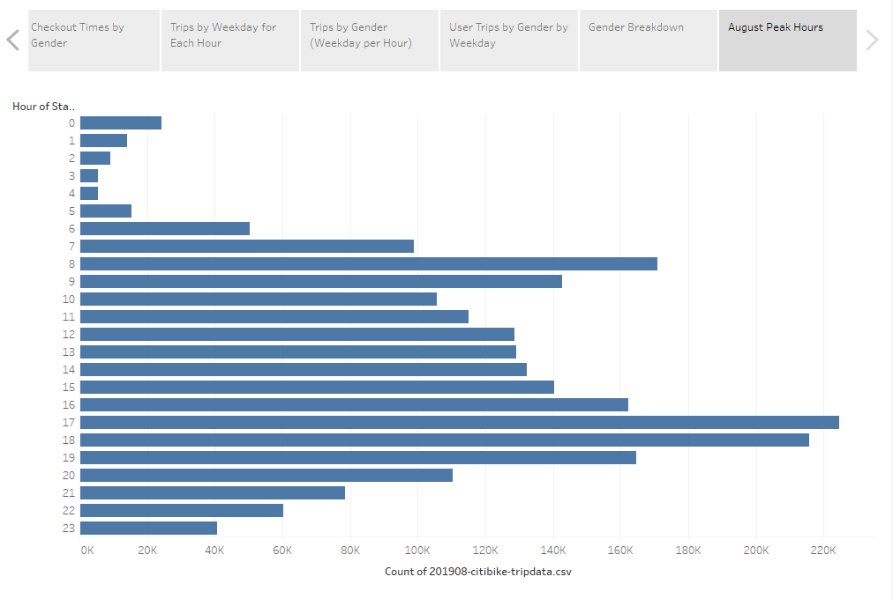
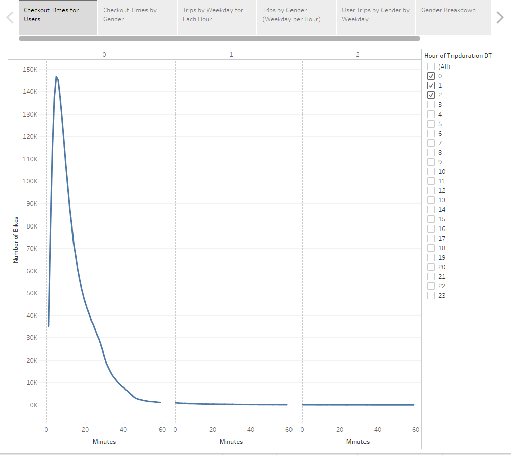
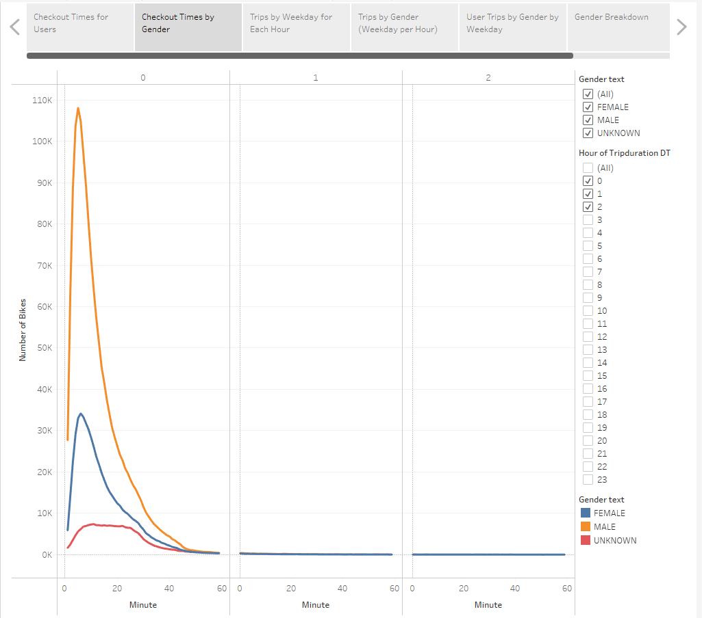
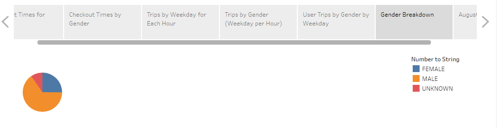
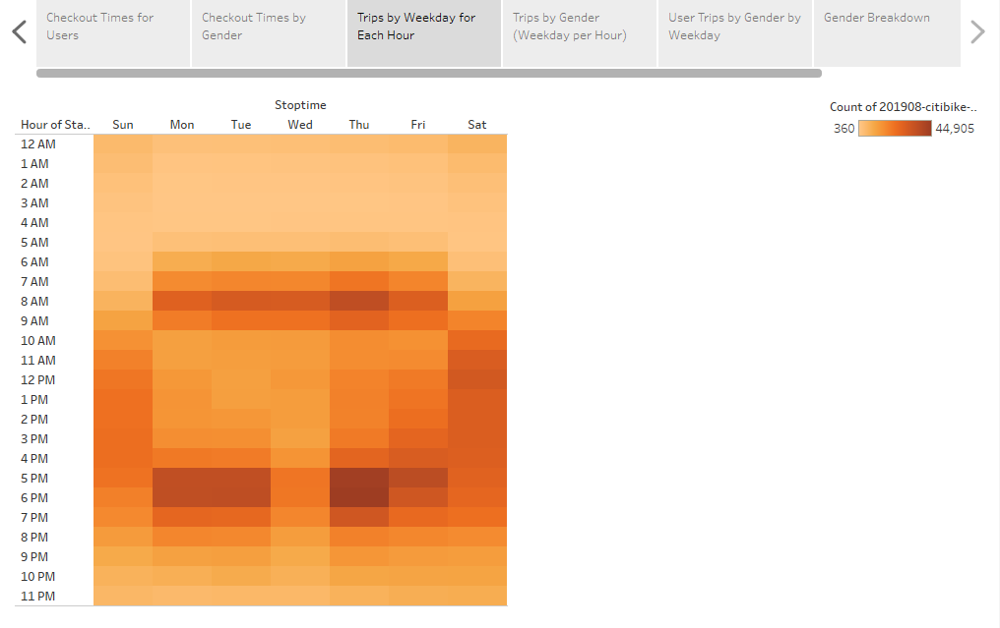
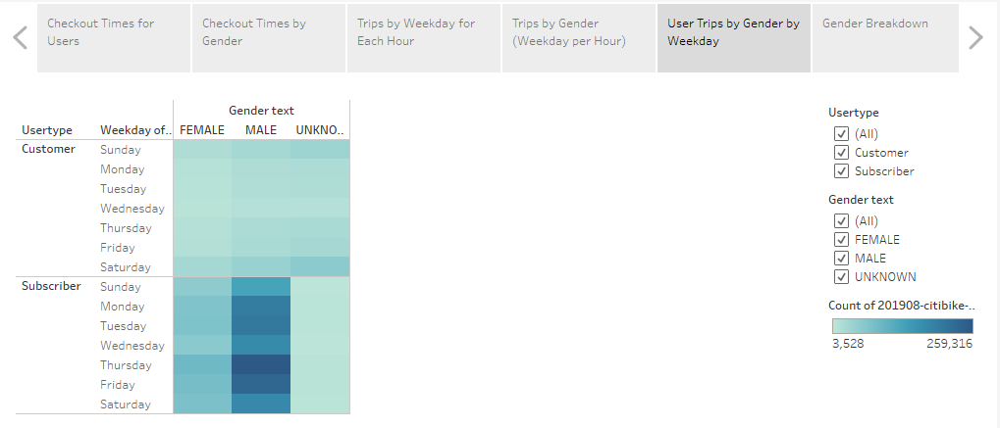

# bikesharing

## Overview
This project is to analyse 'Citi bike sharing' data to support a business case for opening a bike-sharing program in Des Moines, Iowa.

## Results
Tableau visualizations can be accessed here: [link to dashboard](https://public.tableau.com/app/profile/yihao.ni/viz/bikesharing_16230338162440/ChallengeStory)

### Viz 1: August Peak Hours

The visualization shows that peak hours in august are 5pm to 7pm.

### Viz 2: Checkout Time for Users

The visualization shows that most users checkout the bike in under 20 minutes.

### Viz 3: Checkout Times by Gender

The visualization shows that most male and female users checkout the bike in under 20 minutes. However, Unknown users checkout a little later.

### Viz 4: Gender Breakdown

The visualization shows that most users are males.

### Viz 5: Trips by Weekday for Each Hour

The visualization shows that most trips start at 8AM or 5-6PM during the weekdays and in the afternoon on weekends. More trips are on weekdays.

### Viz 6: Trips by Gender (Weekday per Hour)
.PNG)
The visualization shows that regardless of gender, the peak hours remains the same.

### Viz 7: User Trips by Gender by Weekday

The visualization shows that most users are male subscribers, and most trips are taken on Thursdays.

## Summary
