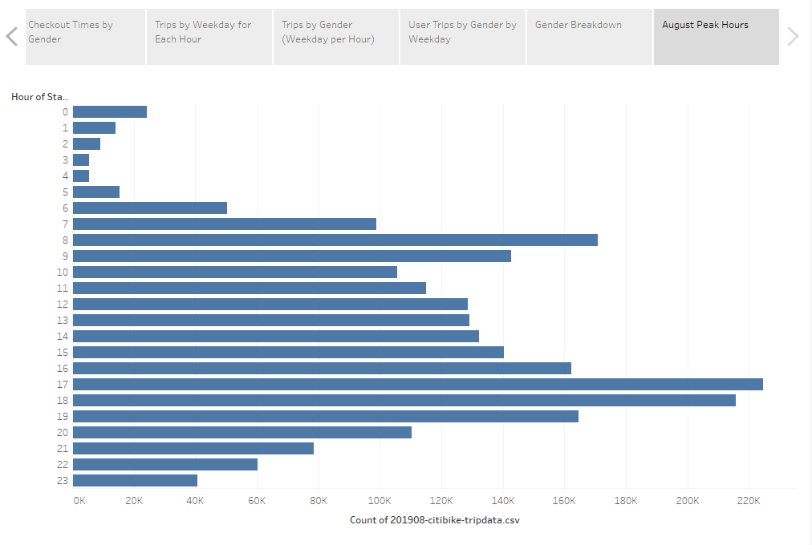

# bikesharing

## Overview
This project is to analyse 'Citi bike sharing' data to support a business case for opening a bike-sharing program in Des Moines, Iowa.

## Results
Tableau visualizations can be accessed here: [link to dashboard](https://public.tableau.com/app/profile/yihao.ni/viz/bikesharing_16230338162440/ChallengeStory)

### Viz 1: August Peak Hours

## Summray
